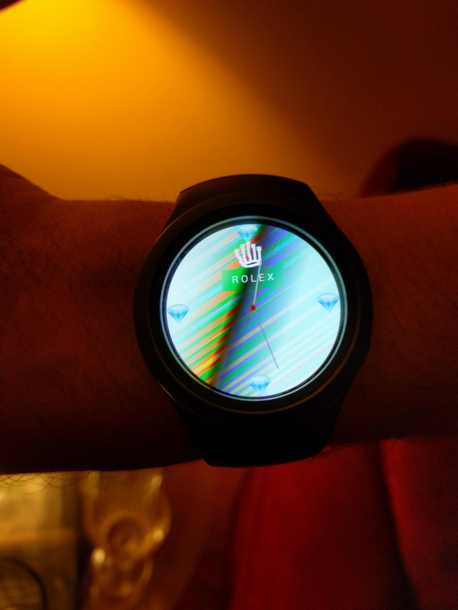

## R O L E X
### A Smart Watch

This repository will give you a custom R O L E X watch for a Samsung Gear S2 smartwatch. The watch runs this Linux thing called Tizen. If you open this project in the Tizen Studio IDE, you can build the project for your watch as a target. It's confusing. It took me all day.

I followed [a guide](https://developer.tizen.org/development/training/web-application/getting-started/creating-your-first-tizen-wearable-web-watch-application) and used Gimp to draw cool stuff. The xcf is in the repo too.

