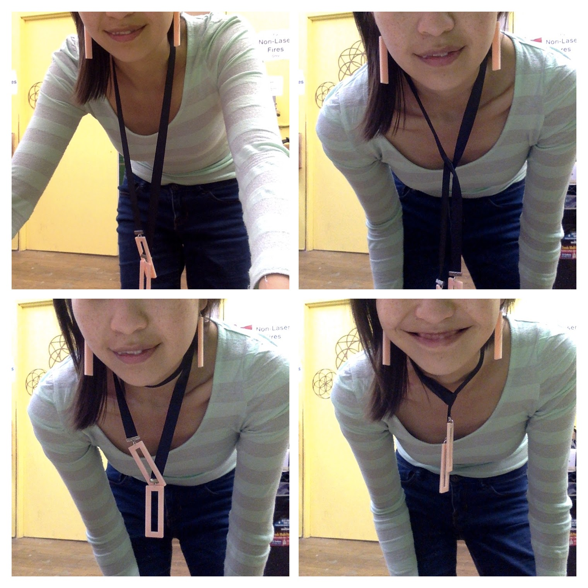
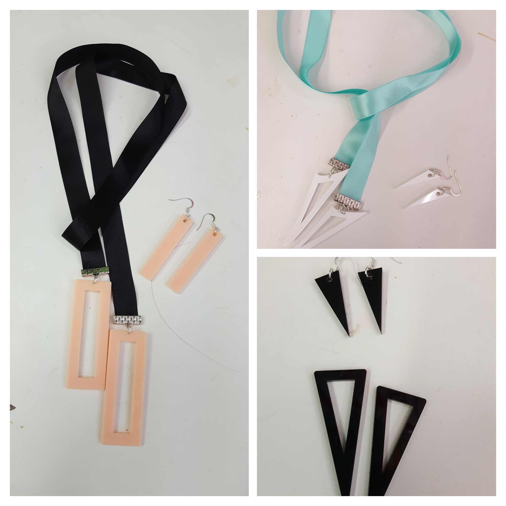

### 4 way lariat necklace and earring set

I designed these 4 way lariat necklace and earring sets!

#### Project Status: Complete but could use some improvements

#### Author: Ruth Grace Wong

#### Date Added: October 26, 2016

#### Tools
1. Pliers for putting together the jewelry findings
2. Laser Cutter - Kaitian CM1309

#### Software
1. Inkscape for making the laser cutting file

#### Howto

Laser the design on 1/8 inch acrylic!

Use standard jewelry findings to put your necklace and earrings together. I've got earring hooks, ribbon, ribbon clamps, and jump rings. Note that you actually want smaller jump rings than I have pictured, so that it fits through the acrylic hole more easily (you can also make the hole diameters bigger in Inkscape or something), and so that that the curved spike shape will fit through itself.

#### Additional Resources
1. [Rectangle laser cutting file](rectangle_lariat.svg)
2. [Triangle laser cutting file](triangle_lariat.svg)
3. [Curved spike laser cutting file](curve_spike_lariat.svg)

