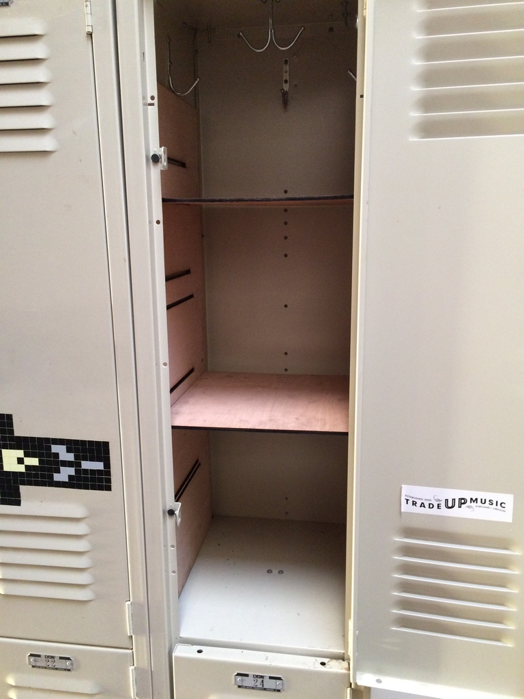

# locker shelves

I made some locker shelves. You can laser cut them at noisebridge. I
used 1/5" plywood. They're kind of a tight fit, but it works well that
way.

Since it's OpenSCAD, you can change the dimensions!

## Modifications

- Lizzie: For some reason importing into the laser scales it slightly (30 inches becomes 33 inches) so I multiplied all the dimensions by 30/33. 🤷
- Trent: I exported the SVG to DXF in inkscape in inches, then imported it into RDWorks and scaled to 105.5% based on test cuts.

