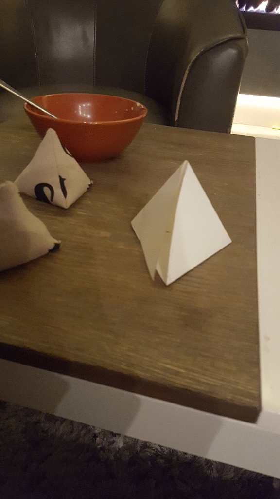

### Cardstock template for triangular pattern weights

Pattern weights are really useful for weighing down fabric or pattern paper when you sew.

#### Project Status: Complete

#### Author: Ruth Grace Wong

#### Date Added: October 26, 2016

#### Tools
1. Fabric
2. Sewing machine, thread, bobbins, hand sewing needle

#### Software
1. Inkscape for making the laser cutting file

#### Howto

Laser the design on cardstock! Follow my instructable! [PDF](Sew-Your-Own-Pattern-Weights.pdf) or [on the web](http://www.instructables.com/id/Sew-Your-Own-Pattern-Weights/)

#### Additional Resources
1. [PDF pattern](pattern_weight.pdf)
2. [laser cutting file](pattern_weight.svg)

