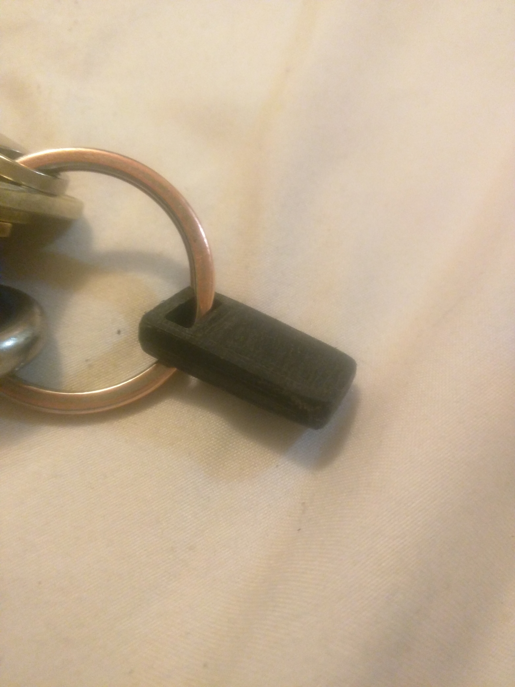
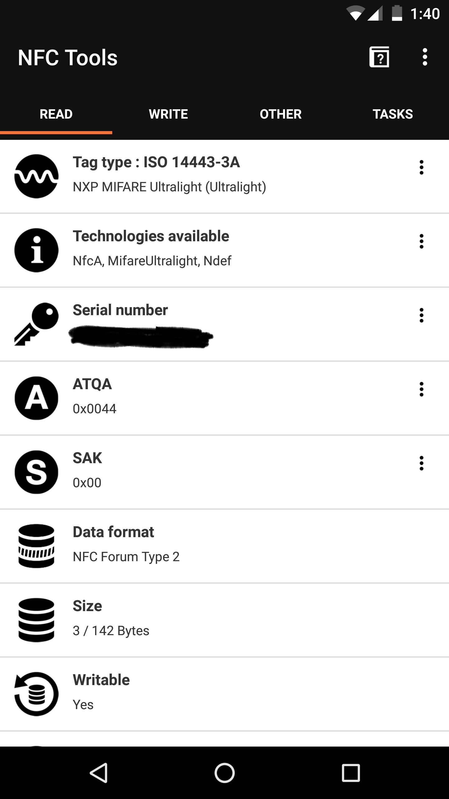

# rfid fob

I made this from an RFID key fob from a reprogrammable rfid tag
someone found in a speaker or something. It's for 3d printing.

This is an openscad program so you can reparameterize it to some other
tag if you want.

It fits together with friction. It was hard to get the lid in. I used
a mallet. Now it's hard to get the lid out. 👍

This is the side with the seam, after sanding.

NFCtools screenshot.

