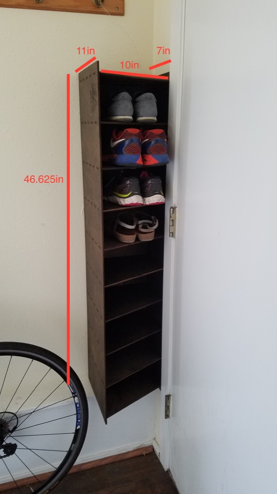
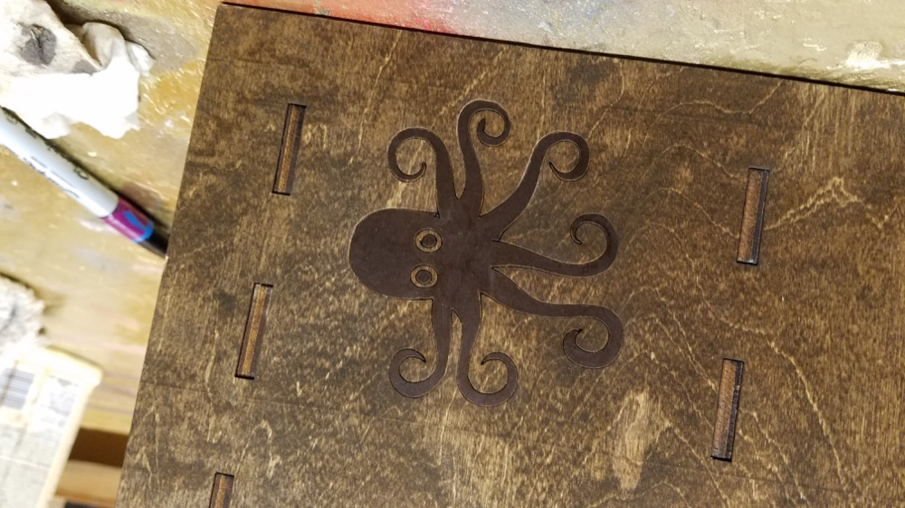
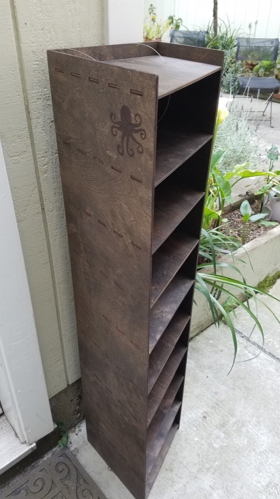

### Shoe Rack !!!

#### Author: Elena Nadolinski 

#### Materials/Tools:
1. 2 Plyboards (48in x 32in x 3/16in)
2. Wood stain (optional)
3. Laser Cutter - Kaitian CM1309

#### Software
1. Autocad (or anything else that deals with .dxf files)

#### How To 
1. Take your plyboards. Stain them - this is purely for aesthetic purposes (wait for an hour for the stain to dry)
2. Laser cut. Make sure to engrave the little octopus guy :) I also sharpied him in so he looks better
	I used 20speed 50power for cutting the wood and 200speed and 20power for engraving 
	

3. Glue 
4. Enjoy

